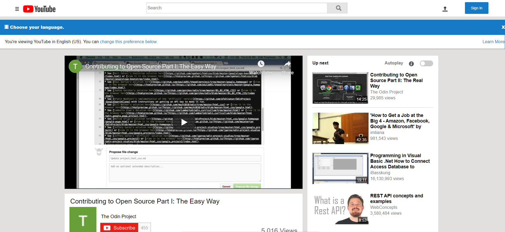

# Project: Embedding Images and Video

> We created a clone of a youtube page, with one video frame,Navigation bar ,and Suggested videos on the side they don't function (they are just photos which mimics the suggested videos like the real youtube page).Also there are links on the footer which also mimics the real youtube page.

## Built With

- HTML5 and CSS3,we have used with flexbox and gridbox in the css part

## Authors

👤 **Author1**

- Github: [@khalilhamdii](https://github.com/khalilhamdii)

👤 **Author2**

- Github: [@Lidya1234](https://github.com/Lidya1234)

## 🤝 Contributing

Contributions, issues and feature requests are welcome! Start by:

Feel free to check the [issues page](issues/).

Forking the project
Cloning the project to your local machine
cd into the project directory
Run git checkout -b your-branch-name
Make your contributions
Push your branch up to your forked repository
Open a Pull Request with a detailed description to the development branch of the original project for a review

## Show your support

Give a ⭐️ if you like this project!
And you are welcome to leave any helpful comments to help us develop a better version of this webpage.
